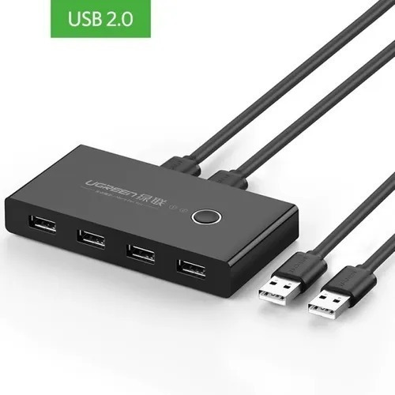

HUB SUB

Esse projeto tem por objetivo estudar Arduino criando um hub usb para trocar os periféricos entre computadores de forma mais simples!

Eu podia comprar um pronto? sim!
Eu podia ver um projeto já existente e copiar? Sim!
Eu podia ver outras alternativas para isso? Sim!

Mas aí qual seria a graça, não é mesmo?

## o projeto
A ideia é criar um switch hub usb como o da imagem abaixo:

# Componentes necessários
- 1x placa Arduino Nano v3
- 2x Conectores USB tipo B
- 4x Conectores USB tipo A
- 1x placa de fenolite cobreado

O custo de compra estimado dos itens é de aproximadamente 50 reais
Até aqui é pelo menos 2x mais barato do que um encontrado na loja (mas isso não é importante)

Para deixar esse projeto melhor contextualizado, eu estou criando um diário aqui no Github para esclarecer cada parte do projeto. 

Aqui vai um aviso importante: Eu não sei, ainda, o que estou fazendo. Todo esse projeto serve para estudo e demonstrar minhas linhas de raciocinio (e me dar um belo emprego que eu receba em Dolar)

